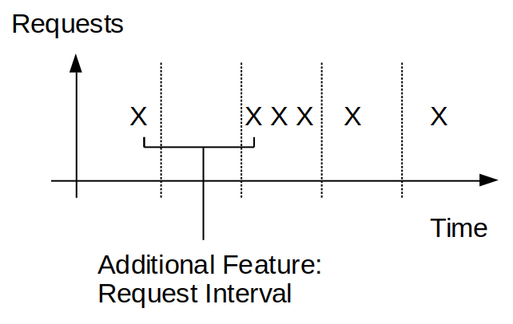
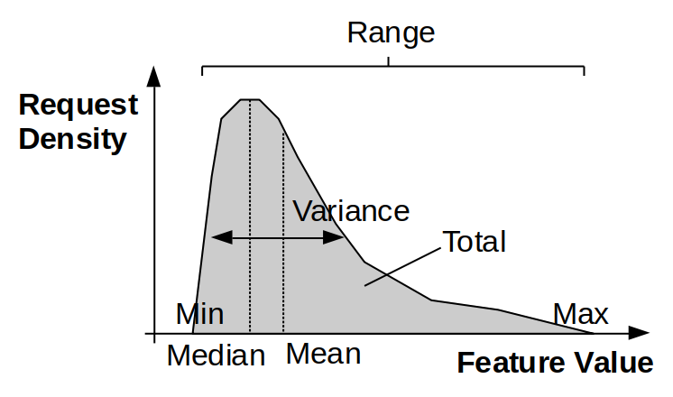

# Feature Overview

Features are calculated based on the distribution of request properties within
a given time bucket. In addition, there is a feature that is dervied from the
time interval _between_ requests in a time bucket. Most features may be broadly 
classified as a total, a ratio of totals, a minimum, a maximum, a mean, a median, 
a variance, or a range in the request property (or request interval property)
being considered. In addition, there may be features that are more complicated
nonlinear functions of request properties. 

For computational efficiency, we do not wish to save the 
entire population of request data and compute these feature values from scratch
every time a new time bucket of data is received. Instead, we require an online
algorithm for feature updating.

If we were to update the population feature value based on the feature value from the most recent 
time bucket and the feature value from all past time buckets,
this could be achieved straightforwardly for the following feature types:
* Total: `new_feature = old_feature + new_feature`
* Min: `new_feature = min(old_feature, new_feature)` 
* Max: `new_feature = max(old_feature, new_feature)`
* Mean: `new_feature = (old_n_requests*old_feature + current_n_requests*new_feature)/new_n_requests` 
However, the features that encapsulate the spread of the property 
(i.e. median, variance, and range) require additional knowledge about the
 population to be updated. For instance, the new variance is given by
```
S_new = ( (n_old-1)*S_old**2 + (n_cur-1)*S_cur**2 + n_old*(m_old - m_new)**2 + n_cur*(m_cur - m_new)**2 ) / (n_old + n_cur - 1) 
```
where S is the variance, n is the number of requests, m is the mean, and the
subscripts indicate whether the old, the current, or the new value is implied
(derivation [here](https://www.emathzone.com/tutorials/basic-statistics/combined-variance.html)). 
 Ratios of totals also require the individual totals that constitute the ratio to be retained,
 and more complicated features may not to be possible to update without knowing the
 whole population of request set data.




In light of the complications associated with feature updating, an alternative
is to forgo obtaining the true population feature value after every time bucket,
and instead, create a new psuedo-feature from:
```python
new_feature = (n_old*old_feature + n_cur*new_feature)/n_new
```
This feature will *not* be the true population value of the feature, 
and will be dependent on the length of the time bucket chosen. 
It is thus important to maintain a constant time bucket 
length if this method is used.

Furthermore, it is worth noting that if the time bucket length is allowed to tend 
to zero so each bucket has at most one request, there will be zero variance in the 
request property in each time bucket, and thus the formula above will also yield
an approximation of zero for the variance, although the population variance may 
be definitively non-zero. It follows that the bucket length should be long relative to the 
request interval, such that the bucket feature values may be considered 
approximations of the population feature values. If this holds, it begs the
question of whether it is worth updating feature values at all, or if they
should just be replaced following each time bucket.