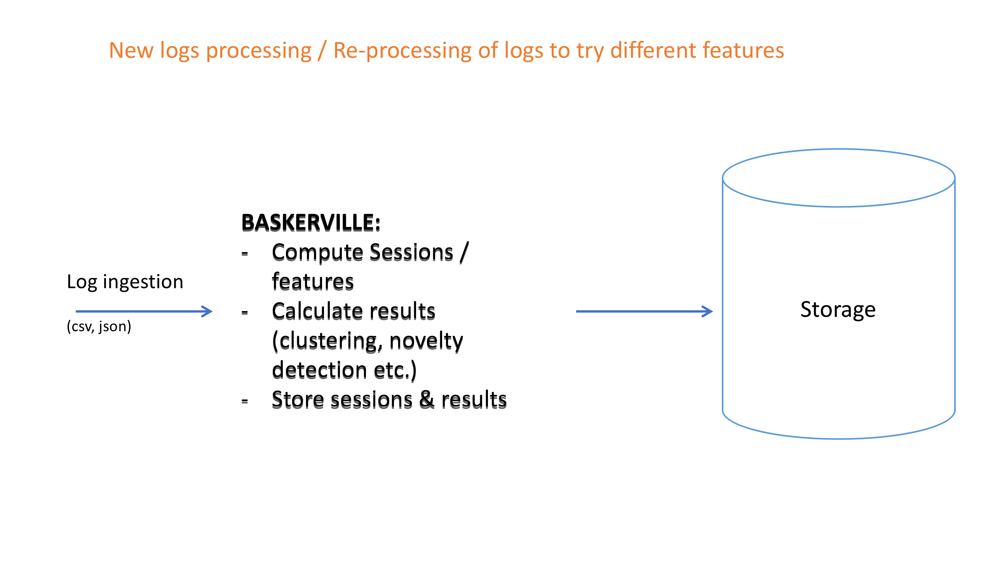
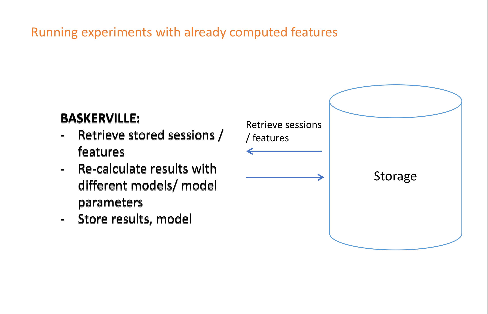
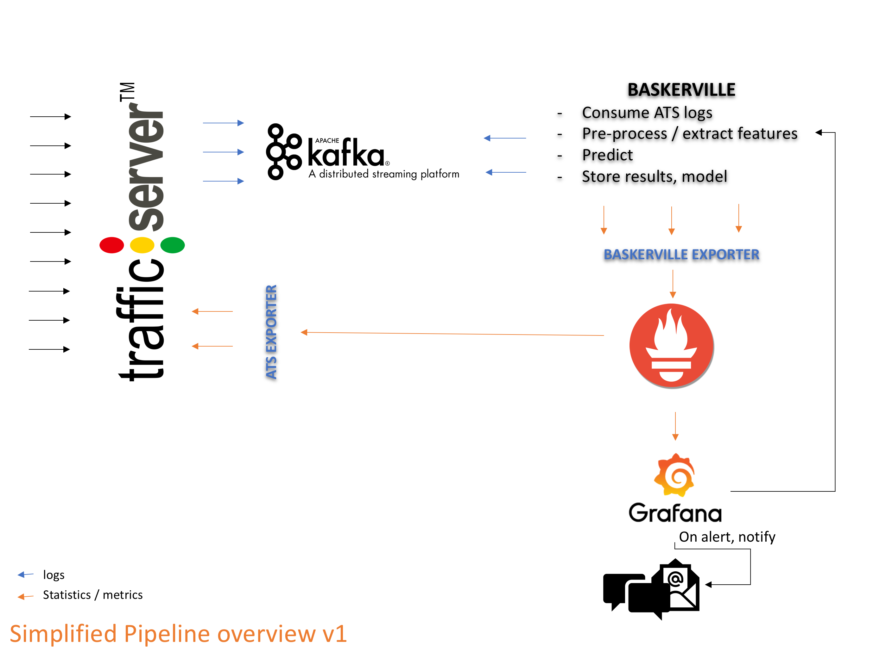
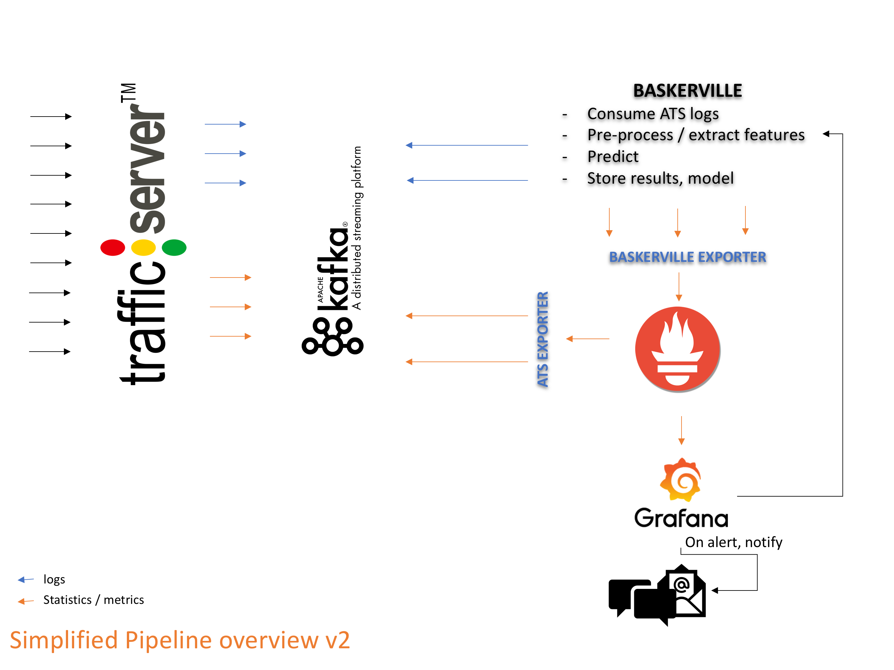

Design Specification for BotHound 2.0
=============

#### TL;DR

- Bothound 2.0 == Baskerville

- Baskerville design overview:
   - [Metrics Monitoring](#metrics-monitoring)
      * Prometheus / Grafana used to monitor ATS metrics, and alert when something crosses threshold.
      * Baskerville triggered via alerts OR analyses all traffic.
   - [Machine Learning: Real-Time Engine](#machine-learning-real-time-engine)
      * Baskerville should run every x time windows for near-real-time effect.
      * Baskerville will consume ATS / Banjax logs directly, ideally enriched via Kafka.
      * Baskerville will compute request sets and extract the features from the traffic. We should either define a request set as a predifined time window, e.g. 2 minutes, or figure out another way to do this.
      * A pre-trained model based on normal traffic for a given defletee will be applied to label the results as benign / malicious (novelty detection).
    - [Machine Learning: Offline Experiments](#machine-learning-offline-experiments)
       * The supervised classifier will be trained offline.
       * Additional experimental tools (e.g. clustering  of malicious IPs into botnets) will be available offline for investigative analysis.
   - [API / Dashboards](#api--dashboards)
      * Network health monitoring dashboard.
      * Overview dashboard: what goes on real-time in Baskerville, what has been processed so far, what are the identified runtimes etc.
      * Alerting dashboard, with the ability to provide feedback on what has been identified as a threat/ attack - True / False positives.
      * Investigations dashboard: visualisations of bot-analysis conducted by Baskerville, with ability to provide feedback.
    - [Alerting System](#alerting)
       * Notify Swabber to block IPs identified as malicious by IP TABLES.
       * Notify another component in ATS to reply with 4xx custom message.
       * Notify the sysops / investigations teams.
       * Alternative ways to block requests need to be tested.
   - [Data Storage](#data-storage)
      * The results of running the module (runtime, request sets, features, verdict, anything else the team can find useful) will be saved to Baskerville Storage.

- Key differences to BotHound:
   * BotHound currently needs a start and end time and a domain to start the analysis.
   * BotHound currently queries ElasticSearch, which is not efficient or real-time, so it won't be used in v. 2.0.
   * BotHound currently computes request sets in an impractical way for real-time execution.
   * BotHound does not have a well-developed / trained / tested machine learning component, or a visualisation dashboard.
   * ATS logs will contain all of the traffic: Batch process the logs, group them by domain / deflectee and compute request sets and perform predictions in parallel.


# Contents

The state of Bothound is presented first in [Current State - BotHound](#current-state---bothound), so that we have an overview of what exists so far (features, data storage, processes). In [Future Plans - Baskerville](#future-plans---baskerville), the ideas for what comes next both structurally and logically are presented. An overview of the proposed Baskerville system follows in [Baskerville System Overview](#baskerville-system-overview). Finally, outstanding questions / ideas are in [Concluding Notes](#concluding-notes).

[**Current State - BotHound**](#current-state---bothound)
1. [Current Components](#current-components)
2. [Current Features](#current-features)
3. [Current Dashboards](#current-dashboards)
4. [Current Data Storage](#current-data-storage)

[**Future Plans - Baskerville**](#future-plans---baskerville)
1. [Metrics Monitoring](#metrics-monitoring)
2. [Machine Learning](#machine-learning)
   * [Real-Time Engine](#machine-learning-real-time-engine)
   * [Offline Experiments](#machine-learning-offline-experiments)
3. [API / Dashboards](#api--dashboards)
4. [Alerting](#alerting)
5. [Data Storage](#data-storage)

[**Baskerville System Overview**](#baskerville-system-overview)
1. [Pipelines](#pipelines)
2. [Interaction / Integration with ATS](#interaction--integration-with-ats)
3. [Evaluation of the System](#evaluation-of-the-system)

[**Concluding Notes**](#concluding-notes)
1. [Other Ideas / Resources](#other-ideas--resources)
2. [Outstanding Questions](#outstanding-questions)


# Current State - BotHound

In its current form, BotHound is not real-time, and relies on manual runtime specification and triggering. It uses ElasticSearch to pull ATS and Banjax logs, create runtime request sets, and compute request set feature vectors. Clustering of request sets (based on their feature vectors) must also be run manually, and the result of the clustering is not used anywhere, e.g. to ban.

For reference, the BotHound 1.0 schematic can be found [here](https://docs.deflect.ca/en/latest/_images/Bothound_scheme.png).


## Current Components

#### Triggering
  - runtimes can be created manually, but not automatically.
  - runtimes must have a fixed end point.
  - Connection to database is insecure.
#### Request Set and Request Set-Feature Computation
  - Logs are pulled from elasticsearch for the runtime period.
  - The web logs for this time period are used to create request sets for the IPs connecting during the incdient. For each of the request sets, a feature vector is computed based on characteristics of the request set (e.g. request set length, average request interval, html/image ratio...).
  - Every time the runtime period changes, the request sets and request set feature vectors are computed from scratch.
#### Clustering
  - There is a clustering script that can be run, given a runtime ID, to group the request sets for that runtime in feature-vector space.
  - This is in an interactive Jupyter notebook form.
#### Labelling
  - Potentially useful functions to label clusters as benign/malicious exist in the BotHound repo `src/util/bothound_tools.py` (e.g. calculate_distances) and in `src/analytics.py` (e.g. calculate_cross_table_banjax), but there is no script to automatically label clusters.
#### Prediction / Supervised model
  - Potentially useful functions to train a supervised model for use in prediction exist in the [learn2ban repo](https://github.com/equalitie/learn2ban).


## Current Features

#### FeatureAverageRequestInterval:
For each IP compute the average time between two requests:
`(Time of last request - time of first request) / # requests` or `MAX_IDEAL_SESSION_LENGTH = 1800  # seconds`.

#### FeatureVarianceRequestInterval
For each IP compute the pair-wise diffs for all the requests in one request set `current_interval = next_sample.time_to_second() - current_sample.time_to_second()`, and then find the variance of the time intervals between two requests: `var(X) = sum (x_i - \bar{X})^2/(n-1)`. This is divided by n-1 because we are estimating the standard deviation using a finite sample of the population.

#### FeatureCyclingUserAgent
Sort user agents by the number of requests descending, get the one with the most requests and divide by the number of requests for the IP: `number of most popular ua requests / # requests`.

#### FeatureHtmlToImageRatio
Zero if `image` or `html` not in any requests, otherwise: `the count of image requests / the count of html requests`.

#### FeatureRequestDepth
This feature returns the average depth of uri requests by IP. For each IP, if none of the requests have `html` doc_type, then the value of the feature is 0, else: `total_page_depth / total_html_requests`.

#### FeatureHTTPResponseCodeRate
0 if `total_error_statuses <= 0` else `total_error_statuses) / total_requests`.

#### FeaturePayloadSizeAverage
`total_size of the payload of all requests / # requests` else 0.

#### FeatureRequestDepthStd
For each request set calculate the number of  `/` in each `html` request path and then compute the standard deviation: `np.std([depth_req_1, depth_req_2...])`.

#### FeatureRequestSetLength
The difference between the last request's time from the first request's time (in seconds).

#### FeaturePercentageConsecutiveRequests
For each request set calculate the number of requests where document type is `html`. The number of consequent requests is calculated by looking at the requested page path, if the path is the same for two or more requests in the loop, then a counter is incremented. Finally, the percentage of consecutive requests = `no_html_requests and num_consec_reqs / float(no_html_requests) or 0`.


## Current Dashboards
There are currently no means of visualization other than Jupyter Notebooks and matplotlib graphs for the clustering process. The results that are saved in a database can be accessed only by quering MySQL.


## Current Data Storage

Bothound and current version of Baskerville use MySQL to keep data about the runtimes, the features, the request sets calculated and the clustering results. The ER model of the database is shown below. Many of the following tables are not currently in use, but there is code for their creation and potential usage. Details of the tables in use are given below.


#### deflectees
Holds information about the deflect protected sites that are involved in runtimes ([see data example](./data/db_data_examples/deflectees.csv)).

*Fields*: `id` (auto increment); `domain` (string: the targeted domain); `comment`

#### encryption
Holds the keys used to encrypt request sets.

*Fields*: `id` (auto increment); `keyhash`; `comment`

#### runtimes
Holds information about the runtimes - this is the entry point of the algorithm so far ([see data example](./data/db_data_examples/runtimes.csv)).

*Fields*: `id` (auto increment); `id_attack` (the attack id, if any); `start` (start date time); `stop` (stop date time); `banjax_start` (respective start date time for banjax); `banjax_stop` (respective stop date time for banjax); `comment`; `process` (boolean flag: to process runtime or not); `target` (string: the targeted domain); `cluster_index` (the index cluster - after clustering analysis); `file_name` (the log file name); `id_encryption` (the encryption id)

#### request sets
Holds the computed request sets ([see data example](./data/db_data_examples/request sets.csv)). Request sets are computed from deflect.log elastic search logs.

*Fields*: `id` (int(11) auto increment); `id_runtime`; `cluster_index`; `cluster_index2`; `IP`; `IP_ENCRYPTED`; `IP_IV`; `IP_TAG`; `ban`; `attack`; `request_interval`; `ua_change_rate`; `html2image_ratio`; `variance_request_interval`; `payload_average`; `error_rate`; `request_depth`; `request_depth_std`; `request set_length`; `percentage_cons_requests`; `latitude`; `longitude`; `id_country`; `id_deflectee`

#### user_agents
Holds the request set user agent details ([see data example](./data/db_data_examples/user_agents.csv)).

*Fields*: `id` (auto increment); `ua` (longtext); `device_family` (longtext); `os_family` (longtext); `os_major` (longtext); `os_minor` (longtext); `os_patch` (longtext); `os_patch_minor` (longtext); `ua_family` (longtext); `ua_major` (longtext); `ua_minor` (longtext); `ua_patch` (longtext)


# Future Plans - Baskerville

The main planned components of Baskerville are:

* [Metrics Monitoring](#metrics-monitoring)
* [Machine Learning](#machine-learning)
   * [Real-Time Engine](#machine-learning-real-time-engine)
   * [Offline Experiments](#machine-learning-real-offline-experiments)
* [API / Dashboards](#api--dashboards)
* [Alerting](#alerting)
* [Data Storage](#data-storage)


## Metrics Monitoring

**Approach 1:** Process traffic logs as they come. This is expensive, but could lead to interesting findings.

**Approach 2:** Trigger Baskerville based ATS metrics alerts. Keep the ATS closely monitored and trigger the Baskerville module when there are changes in the ATS metrics (i.e. listen to incoming network traffic metrics, and activate the module when a threshold is crossed/an anomaly is detected). The disadvantage in this case is that baskerville may be late to identify malicious behaviour.

**Possible metrics sources:**

- **Network health**
- **Network traffic**
   Rate of requests/customers; Proportion of response types; Bytes sent/incoming; Iptables logs (enrich with ASN number, p0f fingerprint, tags based on custom signatures...)
- **HTTP level**
   X-Forwarded-For; Referer; UA analysis; JA3 SSL fingerprint; Tags based on signatures; Regex on specific interesting user agents (whatsapp, telegram etc.); Regex on the user agent for known malicious requests (sqlmap, nikto etc.)
- **Banjax** / **Swabber**
- **Other** Detect website checking if the site is down (http://www.isitdownrightnow.com/ https://isitup.org/)

A full list of ATS metrics available can be found [here](data/metrics/ats_metrics.txt) and [here](data/metrics/ats_experimental_plugin_load_metrics.txt). Custom configured metrics ([metrics.config](https://docs.trafficserver.apache.org/en/latest/admin-guide/files/metrics.config.en.html#metrics-config)) can be defined via Lua scripts.


## Machine Learning


### Machine Learning: Real-Time Engine

#### Triggering
If Approach 2 is taken (non-continuous running of Baskerville), there needs to be a mechanism for triggering the module. Two possibilities for triggering are:

* Simple Implementation: Module is triggered when a threshold is crossed by one or multiple metrics.
* Advanced Implementation: Module is triggered when irregular behaviour is detected by an anomaly detection algorithm.

Once the module is triggered, a "runtime" automatically begins. This is simply a log in the runtime table of the time period and the targeted host(s).

* It should be possible to have ongoing/automatically updating runtimes (e.g. there could be a continuous "runtime" timeseries, that is 0 when the metrics are normal, and 1 otherwise), and it should be possible to manually enter runtime time periods after the fact.
* "Normal" runtimes should be periodically logged for re-training of the supervised learning model.

#### Request Set and Request Set-Feature Computation
* ATS logs should be consumed directly, both deflect and banjax, not by quering the ElasticSearch.
* For efficiency, there shouldn't be complete re-creation of the request set/request set feature vector as the runtime is extended. This will allow for online request set-computation, for a currently ongoing runtime.
* An alternative approach would be to implement a fixed request set duration.
* Additional features should be discussed to help catch non-DDoS web attacks (e.g. regex analysis to identify SQL injection).

#### Prediction
* Stored request set features computed for "normal" reference request sets will be used to train a [novelty detector](#supervised-model-novelty-detection).
* This saved binary classifier will be applied to predict whether new request sets are benign or malicious.
* We should either implement request sets of fixed length, or re-run prediction for ongoing request sets at a pre-determined frequency.

### Machine Learning: Offline Experiments

#### Supervised Model (Novelty Detection)
* The model takes the feature vectors stored for "normal" reference request sets and trains a novelty detection algorithm with:
    ```
    X = request set features
    y = request set classification (0 if normal, 1 if anomalous)
    ```
* Create a generic model for small websites, and specific models for large-audience websites.
* These models, and the scalers used to normalize the data, can be saved for use in online prediction.

The offline experiments should iteratively improve the saved models via the following steps...
* Experimentation with training set, algorithms
* Feature engineering:
   * Check that the correlation between features is low
   * Check that the inclusion of each feature in the model improves the model's score
   * Introduce tuneable parameter for feature weights (implemented in at pre-processing stage, when data is scaled)
   * Experiment with implementing additional features (variation in page request, number of UAs, time at request location, JS/CSS-HTML ratios, 5xx error codes for clustering)
* Cross-validation, hyperparameter tuning
* Comparison with investigations results for benchmarking

An offline visualisations library should be developed for this purpose.


#### Clustering
* Unsupervised clustering of request sets via their feature vectors can be performed offline to identify similar groups of clients, which may be of particular interest when trying to define botnets during the investigations process.
* Having identified clusters, we can attempt to label them as benign/malicious via the following methods:
   - The IP address of each request set in a cluster can be cross-referenced with the banjax logs. If the percentage of IP addresses in the cluster that is blacklisted by banjax is above a certain percentage, we might deduce the other IPs involved in that cluster are also bots.
   - The distance of the cluster centroids from pre-identified and labelled clusters can be used to rate the similarity of new clusters to previously seen types of normal/malicious behaviour.
   - The variation in the cluster size over time may give an indication of whether it represents a botnet or benign clients.
* The labelling of clusters and identification of botnets is anticipated to be an iterative part of the investigations process, more suited to being conducted offline than as an automated process.


## API / Dashboards

The dashboards should contain the following information:

- Network health monitoring dashboard
- Overview dashboard
    - Provides overview of baskerville workload in real-time
    - Number of logs processed / classified traffic
    - Number of deflectees processed / currently processing
    - Number of alerts in total
- Alerting dashboard
    - Number of alerts per deflectee in some window of time
    - Features / values calculated for the alert, plus details of their way of calculation
    - Model parameters and output, e.g. probabilities
    - Possibility of feedback on the alert
- Investigations dashboard
    - Visualisations of bot-analysis conducted by Baskerville (classification / clustering)
    - For use in identifying botnets and re-tuning model parameters as necessary


## Alerting

Utilizing the output of Baskerville: what happens when we need to ban an IP / request?

* In the case where the processing is not continuous but it is based on ats metrics alerting: when a new investigation has started, notify the dashboard and anyone who needs to know.
* When a new alert is created by Baskerville (something is classified as malicious), notify sysops, the associated IP is passed to banjax / Swabber.
* There are multiple potential outcomes following an IP being classified as malicious (banning, null-routing, enabling CAPTCHA...) that should be explored.
* Eventually, we would like to be able to share the features of suspected botnets (with IPs encrypted for privacy) to add to threat-sharing intelligence.


## Data Storage
For the modeling, an orm, like SQLAlchemy, will be used. It will be investigated if MySQL is the most suitable database system for our case or not.

### Data Storage: Real-Time Engine
For the real-time engine, we need to know which model to use and also store:
* Request set features with respective time windows and information about the model used to generate those features.
* Deflectees (i.e. host names).
* Results: The prediction results along with anything useful.
* Alerts: Indicators for the results we need to pay attention to.
* Statistics: These can, and probably should, be computed in a separate process. A time-series db would be the most suitable storage. We can use Prometheus but this means that Prometheus should be configured for long term stats storage.

### Data Storage: Offline Experiments
For the experiments, we need to store the computed request sets with the respective features for reuse.
* **Case 1:** Initial log processing, or in the case where new features have been added or old ones have been modified
    
* **Case 2:** Running experiments with different models and/ or parameters with pre-computed features
    

### Data Storage: API / Dashboard
For the dashboard, we should store:
* Users / Authentication / Authorization
* Deflectees
* Alerts

### Data Storage: Statistics and Alerts
Since the statistics data will be time-series based, and we will have Prometheus and Grafana deployed, a collector can be created to get stats from the engine so that Prometheus consumes them and Grafana can handle the display and alerting. Again, Prometheus should be set with a long term storage solution (if the goal is to keep stats for a long period of time), like Carbon.

### Data Ingestion Rate
By looking at `deflect.log` in opsdash for a period of time, we can get a feel about what kind of load Baskerville will have to be able to handle. For example, the average hour is about 1GB, a day's logs could be around 25GB and so on. One day can have around 29-30 million rows of logs (requests), so if Baskerville processes data every minute, it needs to be able to handle `30000000 / 24 / 60 ~= 20800 requests per minute`.


# Baskerville System Overview


## Pipelines

### Pipelines: Real-Time Engine

The steps are more or less the same in every case, what is different is the algorithm/model used and when it is calculated:

0. Load the pre-trained model and any necessary data
1. Get logs from ATS (enriched logs if features depend on it) via Kafka every `x time window`, e.g. every 2 minutes.
2. Group logs by `host`/ `deflectee` (any other finer grouping can be considered, depending on the features' way of calculation)
3. Preprocess, calculate features, perform all the necessary transformations
4. Predict using pre-trained model
   * Option 1: Novelty detection (preferred)
   * Option 2: Clustering & labelling
5. Store predictions
6. Alert those who need to be notified if malicious activity is detected, which means notify analysts and Swabber to block the ips that need blocking. Ideally, notify ATS to return a 4xx response to the requests (IPs) detected as malicious.

Since the last step can go very wrong while the system is fine-tuned and tested, we need to have a trial period before we actually start banning requests, so perhaps use the Baskerville Dashboard to get feedback from Etienne/ Vladimir about the results of the predictions.

**Pipeline v1:** ATS exporter gets metrics from ats through stats over http.


**Pipeline v2:** Everything is communicated through kafka.


### Pipelines: Offline Experiments

The experiments module will be used for offline experiments, training of models, hyperparameter tuning etc.

1. Load data:
   * Get the logs during known malicious runtimes / benign time periods and compute request sets, OR
   * Get the precomputed request set feature vectors
2. Experimentation:
   * Explore supervised (novelty detection) and unsupervised (clustering) learning
   * Feature engineering: determine which features improve the classification skill
   * Cross-validation: evaluate algorithms / parameters using held out data
   * Visualise results
3. Train binary classifier for use in online prediction
4. Save models, features and results in storage for re-use


## Interaction / Integration with ATS


### ATS Plugins: Stable

From an investigation of the ATS Plugins, the most useful would be stats over http and header rewrite (details below).

#### [Generator](https://docs.trafficserver.apache.org/en/latest/admin-guide/plugins/generator.en.html)

The Generator allows testing of synthetic workloads by generating HTTP responses of various sizes.
The size and cacheability of the response is specified by the first two components of the requested URL path.
This plugin only supports the GET and HEAD HTTP methods.
in `remap.config`:
```
map http://workload.example.com/ http://127.0.0.1/ @plugin=generator.so
```

```
curl -o /dev/null -x 127.0.0.1:8080 http://workload.example.com/cache/10/caf1fc92332b3a3c8cb8b3826b6a1658
or
curl -o /dev/null -x 127.0.0.1:8080 http://workload.example.com/cache/$((10 * 1024 * 1024))/$RANDOM
```

#### [TCP Info](https://docs.trafficserver.apache.org/en/latest/admin-guide/plugins/tcpinfo.en.html)

This global plugin logs TCP metrics at various points in the HTTP processing pipeline.
The TCP information is retrieved by the `getsockopt(2)` function using the `TCP_INFO` option.
This is only supported on systems that support the `TCP_INFO` option, currently Linux and BSD.


#### [Header Rewrite](https://docs.trafficserver.apache.org/en/latest/admin-guide/plugins/header_rewrite.en.html)
Quoted from the docs, this plugin is for occassions when:

- We may need to direct requests to different origins based on a client cookie.

- Our origins might return error response codes which are a little too customized and we wantto condense the possible
values to just the official codes.

- We might want to strip a set of internal-use or debugging related HTTP headers from responses before sending them to clients,
unless the original request had its own special header indicating that they should be retained.

- Or perhaps we want to redirect certain requests differently when they come from a known group of IP addresses (say, our developers’ office network) and we have a file on our proxy caching servers called /var/developertesting. (Stranger QA methods exist.)
- Maybe we want to deny access to a resource with an HTTP 403 if the client connected to Traffic Server
 over a particular port, used HEAD instead of GET, doesn’t list Spanish (Paraguay dialect) in their Accept-Language header, and either the origin server replied with 304 or we randomly generate an integer between 0 and 500 and get back anything greater than 290.

 Some possibly useful operations:

[set-destination](https://docs.trafficserver.apache.org/en/latest/admin-guide/plugins/header_rewrite.en.html#set-destination)
`set-destination <part> <value>`
e.g. `set-destination apiforrejects [L]`
Modifies individual components of the remapped destination’s address. When changing the remapped destination,
<part> should be used to indicate the component that is being modified (see URL Parts), and <value> will be used as its replacement.

[set-redirect](https://docs.trafficserver.apache.org/en/latest/admin-guide/plugins/header_rewrite.en.html#set-redirect)
`set-redirect <code> <destination>`
When invoked, sends a redirect response to the client, with HTTP status `<code>`, and a new location of `<destination>`.
If the QSA flag is enabled, the original query string will be preserved and added to the new location automatically.
This operator supports Variable Expansion for `<destination>`.

[skip-remap](https://docs.trafficserver.apache.org/en/latest/admin-guide/plugins/header_rewrite.en.html#skip-remap)
`skip-remap <value>`
When invoked, and when <value> is any of 1, true, or TRUE,
this operator causes Traffic Server to abort further request remapping.
Any other value and the operator will effectively be a no-op.

Conditions:
In general, they come in form: `cond %{<condition name>[:<argument>]} <operand> [<flags>]`
For example:
```
cond %{STATUS} >399 [AND]
cond %{STATUS} <500
set-status 404
```

Some conditions that might be useful in our case:

[FROM-URL](https://docs.trafficserver.apache.org/en/latest/admin-guide/plugins/header_rewrite.en.html#from-url)
`cond %{FROM-URL:<part>} <operand>`

[CLIENT-URL](https://docs.trafficserver.apache.org/en/latest/admin-guide/plugins/header_rewrite.en.html#client-url)
cond %{CLIENT-URL:<part>} <operand>

[INBOUND](https://docs.trafficserver.apache.org/en/latest/admin-guide/plugins/header_rewrite.en.html#inbound)
`cond %{INBOUND:TLS} /./`
```
%{INBOUND:LOCAL-ADDR}      The local (ATS) address for the connection. Equivalent to %{IP:INBOUND}.
%{INBOUND:LOCAL-PORT}      The local (ATS) port for the connection. Equivalent to %{INCOMING-PORT}.
%{INBOUND:REMOTE-ADDR}     The client address for the connection. Equivalent to %{IP::CLIENT}.
%{INBOUND:REMOTE-PORT}     The client port for the connection.
%{INBOUND:TLS}             The TLS protocol if the connection is over TLS, otherwise the empty string.
%{INBOUND:H2}              The string "h2" if the connection is HTTP/2, otherwise the empty string.
%{INBOUND:IPV4}            The string "ipv4" if the connection is IPv4, otherwise the emtpy string.
%{INBOUND:IPV6}            The string "ipv6" if the connection is IPv6, otherwise the empty string.
%{INBOUND:IP-FAMILY}       The IP family, either "ipv4" or "ipv6".
%{INBOUND:STACK}           The full protocol stack separated by ','.
```

[IP](https://docs.trafficserver.apache.org/en/latest/admin-guide/plugins/header_rewrite.en.html#ip)
cond %{IP:<part>} <operand>
```
%{IP:CLIENT}     Client's IP address. Equivalent to %{INBOUND:REMOTE-ADDR}.
%{IP:INBOUND}    ATS's IP address to which the client connected. Equivalent to %{INBOUND:LOCAL-ADDR}
%{IP:SERVER}     Upstream (next-hop) server IP address (typically origin, or parent)
%{IP:OUTBOUND}   ATS's outbound IP address, that was used to connect upstream (next-hop)
```


### ATS Plugins: Experimental

From an investigation of the ATS Plugins, the most useful would be System stats, since it offers load information (details below).

#### [System stats](https://docs.trafficserver.apache.org/en/latest/admin-guide/plugins/system_stats.en.html)
Adds extra metrics in stats over http for load monitoring. An example of the metrics can be found [here](data/metrics/ats_experimental_plugin_load_metrics.txt).

Example of output [here](data/metrics/ats_metrics.txt), after the `Experimental plugin for load info`.

#### [FQ Pacing](https://docs.trafficserver.apache.org/en/latest/admin-guide/plugins/fq_pacing.en.html)
Rate limit an individual TCP connection.
It is based on Linux support for the Fair Queuing qdisc. `FQ` and `SO_MAX_PACING_RATE` is available
in RedHat/Centos 7.2+, Debian 8+, and any other Linux distro with a kernel 3.18 or greater.

#### [MySQL Remap](https://docs.trafficserver.apache.org/en/latest/admin-guide/plugins/mysql_remap.en.html)
A basic plugin for doing dynamic “remaps” from a database.

```
"
We have benchmarked the plugin with ab at about 9200 requests/sec (1.7k object) on a commodity hardware with a local setup of both,
MySQL and Traffic Server local. Real performance is likely to be substantially higher, up to the MySQL’s max queries / second.
"
mysql -u root -p -e "CREATE DATABASE mysql_remap;"   # create a new database
mysql -u root -p mysql_remap < schema/import.sql     # import the provided schema

# in /etc/trafficserver/plugin.config
mysql_remap.so /etc/trafficserver/mysql_remap.ini

# example:
[mysql_remap]
mysql_host     = localhost   #default
mysql_port     = 3306        #default
mysql_username = remap_user
mysql_password =
mysql_database = mysql_remap #default

# for debugging:
traffic_server -T "mysql_remap"

```

or use:
`traffic_ctl config reload` (how much time?)

In combination with:
https://docs.trafficserver.apache.org/en/latest/admin-guide/files/remap.config.en.html?highlight=remap#named-filters

```
.definefilter disable_delete_purge @action=deny @method=delete @method=purge
.definefilter local_only @action=allow @src_ip=192.168.0.1-192.168.0.254 @src_ip=10.0.0.1-10.0.0.254

.activatefilter disable_delete_purge

map http://foo.example.com/ http://bar.example.com/

.activatefilter local_only
map http://www.example.com/admin http://internal.example.com/admin
.deactivatefilter local_only

map http://www.example.com/ http://internal.example.com/
map http://auth.example.com/ http://auth.internal.example.com/ @action=allow @internal
```
Or [ip_allow.config](https://docs.trafficserver.apache.org/en/latest/admin-guide/files/ip_allow.config.en.html)
```
src_ip=<range of IP addresses> action=<action> [method=<list of methods separated by '|'>]
dest_ip=<range of IP addresses> action=<action> [method=<list of methods separated by '|'>]
```

Problem with this approach: not flexible for banning. It would create huge lists.


## Evaluation of the System

### Benchmarking

Evaluation of Baskerville's models may be performed using:
* Datasets of known attacks
* Datasets of known benign traffic

### Evaluation period
Deploy and run the system but do not actually block with the results, evaluate first for a period of time.


# Concluding Notes

## Other Ideas / Resources
* Reputation Engine:
   http://getrepsheet.com/index.html; https://github.com/repsheet/repsheet-nginx
* HELK:
   https://github.com/Cyb3rWard0g/HELK
* D3JS:
   https://d3js.org/

## Outstanding Questions
* What threshold should be used for triggering? We need to choose something that's low enough to give Baskerville some time to analyse logs and create predictions.
* Since Baskerville will be running for all deflectees (analysing all traffic), we need to either find a way to identify the deflectee that's causing the problem (if any) or keep running for all deflectees.
* How can we calculate features accumulatively for ongoing request sets? If we use a fixed length request set, what happens if a request set spreads in more than one time windows?
* If Banjax has already blocked something then what use do we have for consuming Banjax logs in real-time? Use them to verify predictions?


<a rel="license" href="http://creativecommons.org/licenses/by/4.0/">
</a><br />
This work is copyright (c) 2020, eQualit.ie inc., and is licensed under a <a rel="license" href="http://creativecommons.org/licenses/by/4.0/">Creative Commons Attribution 4.0 International License</a>.